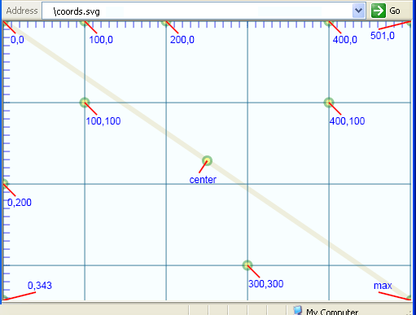

# svg 基础教程
SVG(Scalable Vector Graphics，可伸缩矢量图形)是一种相对新的W3C标准。

## SVG 优势

- 比位图更小，下载速度更快。
- 缩放无不失真，适应不同的设备。
- SVG 在浏览器中构建，减少了服务器和网络传输的压力。
- 客户端可以与 SVG 进行交互并做修改，无需网络通信。
- ~~SVG 提供 SMIL 动画（自从 Chrome 45，SMIL 动画被弃用了）~~
- 可以使用 JavaScript 操作 SVG。

## 为什么 SVG 是一种 XML 语言

- 遵守代码编写及客户端渲染的规范。
- 如 XML 一样，SVG 也用描述文本表示，可读性高。
- 也是最重要的一点，可以使用 JavaScript 操作 SVG。

## SVG 坐标系

SVG的坐标系与HTML一样。原点(0,0)在左上角。向右移动，x增加。向下移动，y增加。

## 参考文章
- [SVG](https://www.w3.org/Graphics/SVG/IG/resources/svgprimer.html)